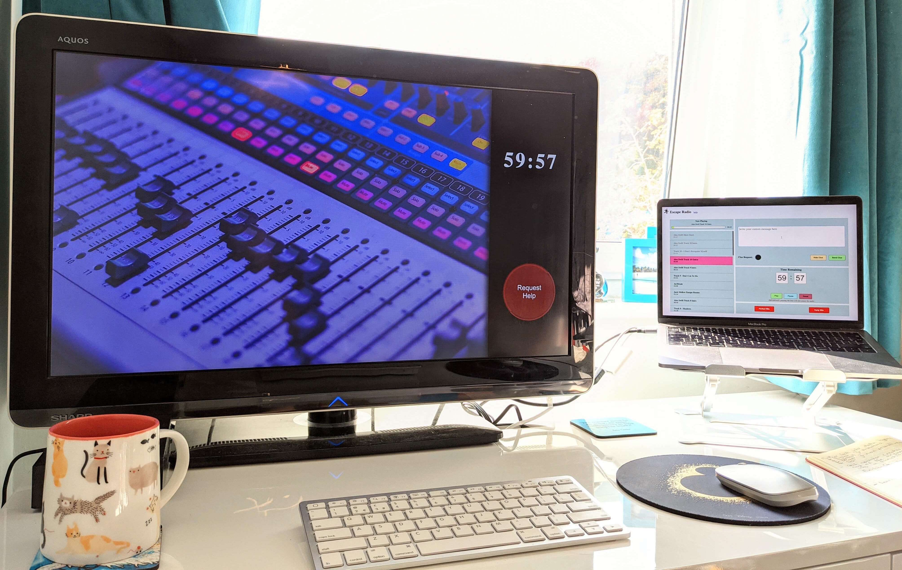

# Escape Radio
This is an escape game system which handles in-game soundtrack, receives clue requests & sends clue messages, and calculates & displays the time remaining based on the audio playlist still to play.

This prototype is made up of two screens, see below on how to set them up: 
> Admin - [https://escaperadio.netlify.app](https://escaperadio.netlify.app)

> Player - [https://escaperadio.netlify.app/player](https://escaperadio.netlify.app/player)

## Why Is The Time Remaining Based On The Audio Playlist?
The game this was designed for centred around a recording studio. The story was that the radio station has lost the number 1 track in it's top 10 chart show, the team must enter the recording studio and remix that number 1 song before the radio station reaches number 1 in the charts. The audio playlist is the radio show so that the team can hear how close they are to number 1.

## How Do I Set It Up
In practise this would be run on *local host* and the computer hooked up to two screens. One screen would be in the host's office, where they sit to monitor and run the game, this will have the *admin* page open. The other screen would be in the game for players to interact with, this will have the *player* page open. Audio from the computer would be routed to speakers inside the game. The request help button would be a physical button communicating via a node.js backend, for the prototype demonstration this is a virtual button on screen. 

**If you wish to test the prototype just open up the [admin](https://escaperadio.netlify.app) and [player](https://escaperadio.netlify.app/player) screens in different tabs or browser windows. See the image below for a visual example.**

## I Am All Set Up... Now How Does It Work?

**Running The Game**
1. Click the green `Load` button on the admin screen. This will load in the audio tracks.
2. When loading is complete hit `Play`
3. If a player presses the `Request Help` button the *Clue Request* indicator will flash red
4. Send a clue to the player screen at any time with the input box and pressing `Send Clue`
5. When you are done showing that message to the player click `Hide Clue`
6. If the team win the game you can click the `Win` button to play the success audio
7. If the time runs out then the team will automatically receive the fail ending
8. Use the `Reset` button to reset the game for the next team

**Other Features**
- You can pause the game at any time. This does also pause the audio (because the time is based on the audio tracks) so pause is only likely to be used for game breaking issues
- While paused, or before pressing `Play`, you are able to change the current audio track by clicking on a different track in the playlist. The newly highlighted track will play from the beginning when you hit `Play`

## Credits
The coding and radio presenter script in this prototype are mine but I also used, placeholder music tracks and some talented actors for the voiceovers.
- Presenter Voiceover: Isobelle Pippin
- Adverts Script: Isobelle Pippin 
- Adverts Voiceovers: Eve Winters, Robyn Holdaway, Another Name
- Music: Bensound.com

## Tech
This uses HTML with custom CSS and Javascript. The communication between browser windows is achieved using the  *Broadcast Channel API* and the audio tracks are handled with *howler.js*
